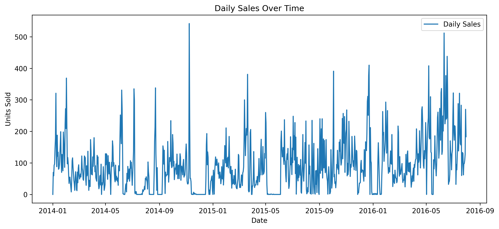
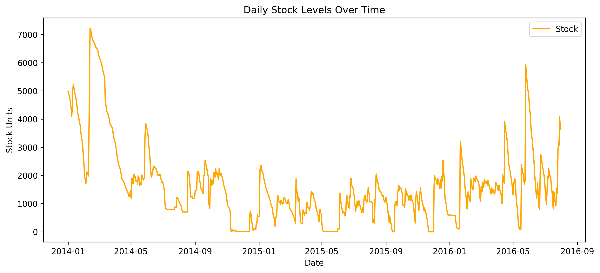
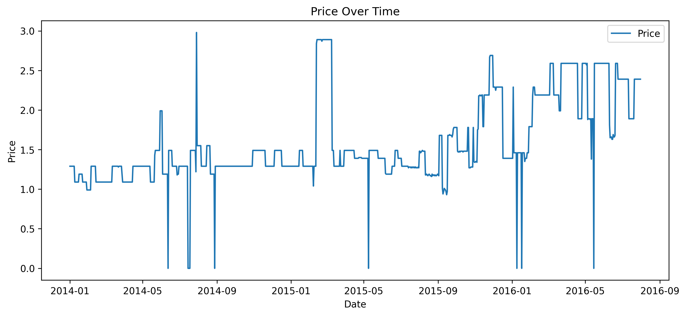
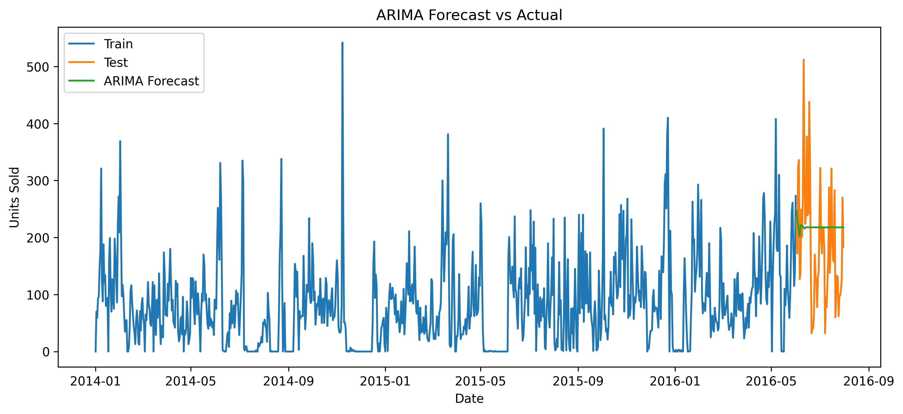
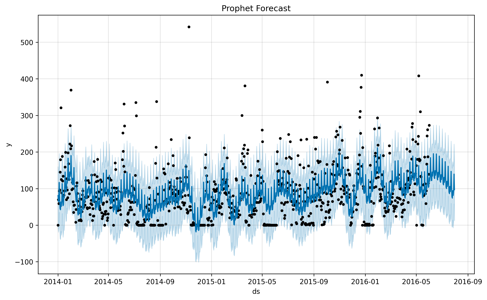
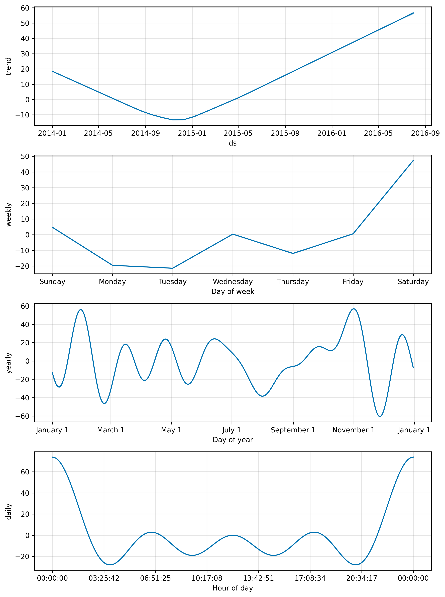

# Demand Forecasting Report

## Overview
This report summarizes the analysis performed on the **mock_kaggle.csv** dataset.  
The goal was to explore historical sales data and build baseline forecasting models, followed by advanced models (ARIMA, Prophet).

---

## Dataset
- **Rows:** 937  
- **Columns:**
  - `data` → Date
  - `venda` → Sales (units sold)
  - `estoque` → Stock levels
  - `preco` → Price
- **Period covered:** 2014-01-01 to 2016-07-31  
- **Missing values:** None

---

## Exploratory Data Analysis (EDA)

**Daily Sales Over Time**  

**Stock Levels Over Time**  

**Price Over Time**  

---

## Time Series Decomposition
- **Trend:** Gradual growth in sales volume.  
- **Seasonality:** Monthly and weekly patterns are visible.  
- **Residuals:** Random fluctuations not explained by trend/seasonality.  

---

## Baseline Forecasts
- **Naive Forecast:** Yesterday = today.  
- **7-day Moving Average:** Smooths short-term noise.  
- **Evaluation:** MAPE values show that moving average outperforms naive.  

---

## Advanced Models

**ARIMA Forecast vs Actual**  

**Prophet Forecast**  

**Prophet Components (Trend & Seasonality)**  

---

## Next Steps
1. Test additional ARIMA parameter sets (grid search).  
2. Extend Prophet with holiday effects or extra regressors (`preco`, `estoque`).  
3. Experiment with ML-based forecasting (e.g., XGBoost).  
4. Create a dashboard (Power BI / Tableau) to present forecasts interactively.
